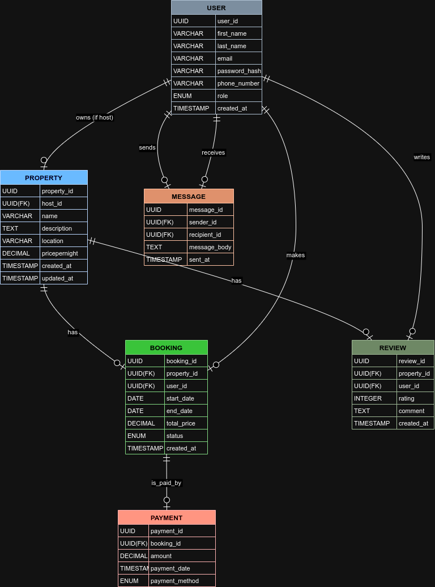

# Database Specification - AirBnB

## ER diagram

## Entities and Their Attributes

### **1. User**

- **user_id**: Primary Key, UUID, Indexed
- **first_name**: VARCHAR, NOT NULL
- **last_name**: VARCHAR, NOT NULL
- **email**: VARCHAR, UNIQUE, NOT NULL
- **password_hash**: VARCHAR, NOT NULL
- **phone_number**: VARCHAR, NULL
- **role**: ENUM (guest, host, admin), NOT NULL
- **created_at**: TIMESTAMP, DEFAULT CURRENT_TIMESTAMP

### **2. Property**

- **property_id**: Primary Key, UUID, Indexed
- **host_id**: Foreign Key, references **User(user_id)**
- **name**: VARCHAR, NOT NULL
- **description**: TEXT, NOT NULL
- **location**: VARCHAR, NOT NULL
- **pricepernight**: DECIMAL, NOT NULL
- **created_at**: TIMESTAMP, DEFAULT CURRENT_TIMESTAMP
- **updated_at**: TIMESTAMP, ON UPDATE CURRENT_TIMESTAMP

### **3. Booking**

- **booking_id**: Primary Key, UUID, Indexed
- **property_id**: Foreign Key, references **Property(property_id)**
- **user_id**: Foreign Key, references **User(user_id)**
- **start_date**: DATE, NOT NULL
- **end_date**: DATE, NOT NULL
- **total_price**: DECIMAL, NOT NULL
- **status**: ENUM (pending, confirmed, canceled), NOT NULL
- **created_at**: TIMESTAMP, DEFAULT CURRENT_TIMESTAMP

### **4. Payment**

- **payment_id**: Primary Key, UUID, Indexed
- **booking_id**: Foreign Key, references **Booking(booking_id)**
- **amount**: DECIMAL, NOT NULL
- **payment_date**: TIMESTAMP, DEFAULT CURRENT_TIMESTAMP
- **payment_method**: ENUM (credit_card, paypal, stripe), NOT NULL

### **5. Review**

- **review_id**: Primary Key, UUID, Indexed
- **property_id**: Foreign Key, references **Property(property_id)**
- **user_id**: Foreign Key, references **User(user_id)**
- **rating**: INTEGER, CHECK: rating >= 1 AND rating <= 5, NOT NULL
- **comment**: TEXT, NOT NULL
- **created_at**: TIMESTAMP, DEFAULT CURRENT_TIMESTAMP

### **6. Message**

- **message_id**: Primary Key, UUID, Indexed
- **sender_id**: Foreign Key, references **User(user_id)**
- **recipient_id**: Foreign Key, references **User(user_id)**
- **message_body**: TEXT, NOT NULL
- **sent_at**: TIMESTAMP, DEFAULT CURRENT_TIMESTAMP

---

## Relationships Between Entities

### **1. User to Property**
- **Relationship**: One-to-many
- A **User** (specifically a **Host**) can own multiple **Properties**. 
- The **Property** table has a foreign key (`host_id`) referencing the **User** table.

### **2. User to Booking**
- **Relationship**: One-to-many
- A **User** (whether guest or host) can make multiple **Bookings**.
- The **Booking** table has a foreign key (`user_id`) referencing the **User** table.

### **3. Property to Booking**
- **Relationship**: One-to-many
- A **Property** can have multiple **Bookings**.
- The **Booking** table has a foreign key (`property_id`) referencing the **Property** table.

### **4. Booking to Payment**
- **Relationship**: One-to-one
- A **Booking** can have one associated **Payment**.
- The **Payment** table has a foreign key (`booking_id`) referencing the **Booking** table.

### **5. Property to Review**
- **Relationship**: One-to-many
- A **Property** can have multiple **Reviews**.
- The **Review** table has a foreign key (`property_id`) referencing the **Property** table.

### **6. User to Review**
- **Relationship**: One-to-many
- A **User** (either guest or host) can leave multiple **Reviews**.
- The **Review** table has a foreign key (`user_id`) referencing the **User** table.

### **7. User to Message**
- **Relationship**: One-to-many (both ways)
- A **User** can send multiple **Messages** to other **Users**.
- The **Message** table has two foreign keys: 
  - `sender_id` referencing **User(user_id)** (sender).
  - `recipient_id` referencing **User(user_id)** (recipient). 

---

## Constraints and Indexing

### **User Table Constraints:**
- Unique constraint on **email**.
- Non-null constraints on **first_name**, **last_name**, **email**, **password_hash**, and **role**.

### **Property Table Constraints:**
- Foreign key constraint on **host_id** (references **User(user_id)**).
- Non-null constraints on **name**, **description**, **location**, and **pricepernight**.

### **Booking Table Constraints:**
- Foreign key constraints on **property_id** and **user_id**.
- The **status** must be one of `pending`, `confirmed`, or `canceled`.

### **Payment Table Constraints:**
- Foreign key constraint on **booking_id** (references **Booking(booking_id)**).
- Non-null constraints on **amount** and **payment_method**.

### **Review Table Constraints:**
- Constraints on **rating** to ensure it is between 1 and 5.
- Foreign key constraints on **property_id** and **user_id**.

### **Message Table Constraints:**
- Foreign key constraints on **sender_id** and **recipient_id**.

### **Indexing:**
- Primary keys are indexed automatically.
- Additional indexes are created on:
  - **email** in the **User** table.
  - **property_id** in the **Property** and **Booking** tables.
  - **booking_id** in the **Booking** and **Payment** tables.